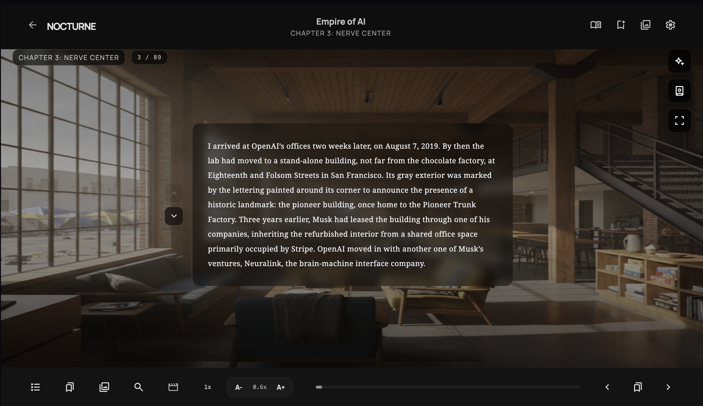
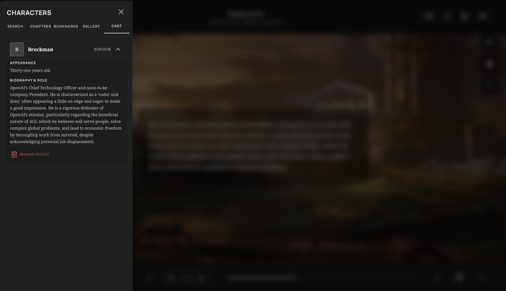

# Visual E-Reader: Context-Aware Multimodal Reading Platform

An interactive, offline-capable production-grade digital reading web application that enriches narrative text with real-time AI-generated contextual imagery and adaptive ambient soundscapes. Built with React, TypeScript, Vite, and Google Gemini.






---

## Key Features

- **Contextual Visual Generation**: Analyzes reading passages and generates dynamic scene illustrations via Google Gemini and local generative image pipelines.
- **Web Worker Architecture**: Offloads parsing and model task orchestration to background web workers (`llm.worker.ts`), preventing main thread UI blocking.
- **Offline-First Persistence**: Utilizes browser-native IndexedDB (`db.ts`) to locally cache full-text libraries, settings, and generated multimodal assets.
- **Dynamic Library Management**: Full EPUB/text ingestion and reading progress tracking across multiple documents.

---

## Technical Stack

- **Frontend Core**: React 18, TypeScript, Vite
- **Styling**: Tailwind CSS
- **AI & Multimodal Services**: Google Gemini API, Custom Audio/Visual Pipeline
- **Concurrency**: Web Workers API (`llm.worker.ts`)
- **Persistence**: IndexedDB Client-Side Storage

---

## Architecture Overview

```text
src/
├── App.tsx               # Main application container & reading viewport
├── LibraryPage.tsx       # Local book repository & document upload interface
├── SettingsModal.tsx     # API credential management & rendering preferences
├── db.ts                 # IndexedDB schema & asset caching layer
├── gemini.ts             # Google Gemini client & prompt orchestration
├── llm.worker.ts         # Dedicated Web Worker for off-thread AI tasks
├── lyriaEngine.ts        # Ambient audio synthesis engine
└── localImageEngine.ts   # Client-side image generation and caching handler

```
### Getting Started

## 1. Installation
Clone the repository and install dependencies:

```
git clone [https://github.com/CV145/Visual-EReader.git](https://github.com/CV145/Visual-EReader.git)
cd Visual-EReader
npm install
```

## 2. Environment Variables
Create a .env file in the root directory:

```
VITE_GEMINI_API_KEY=your_gemini_api_key_here
```

## 3. Run Development Server

```
npm run dev
```

## 4. Production Build

```
npm run build
```